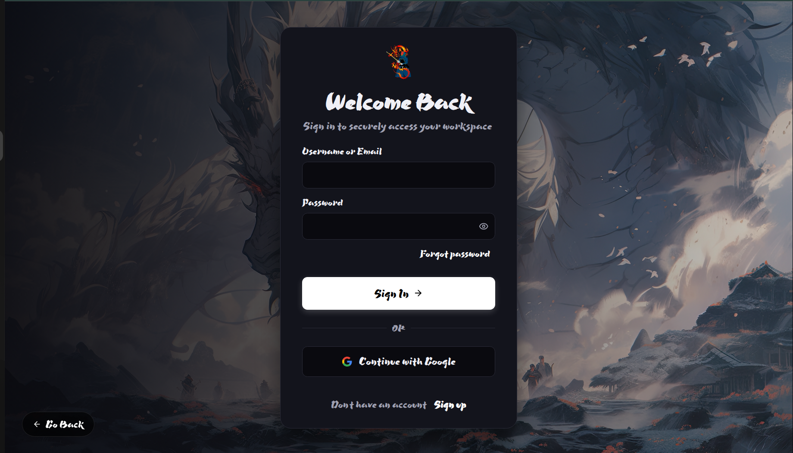
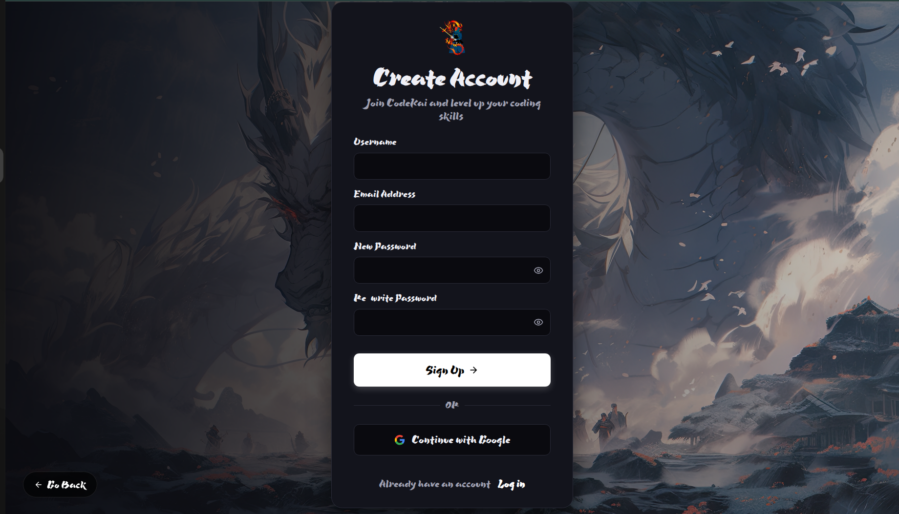
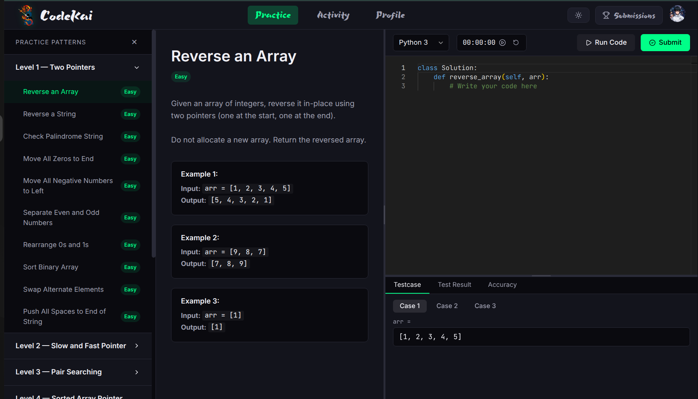
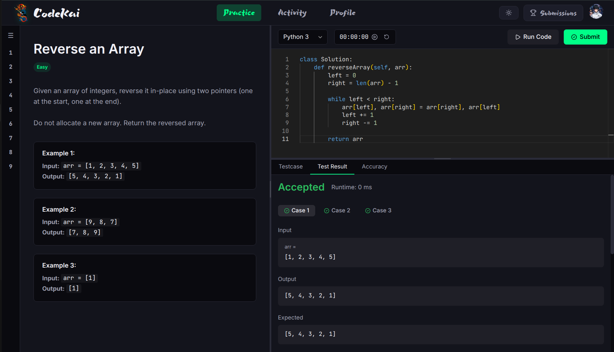
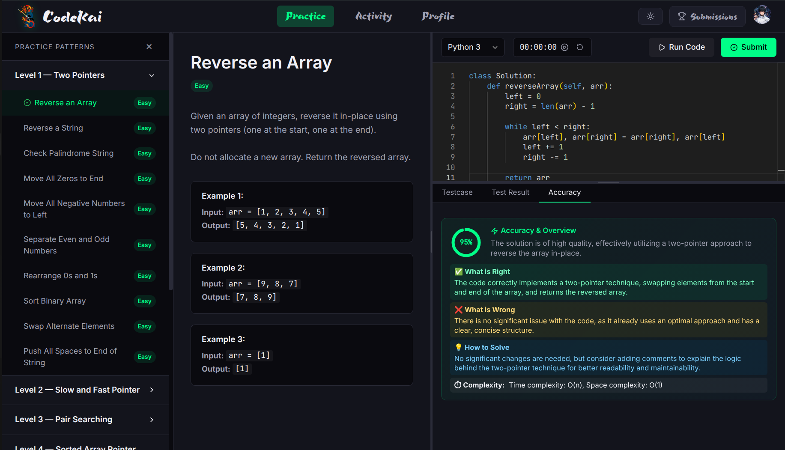
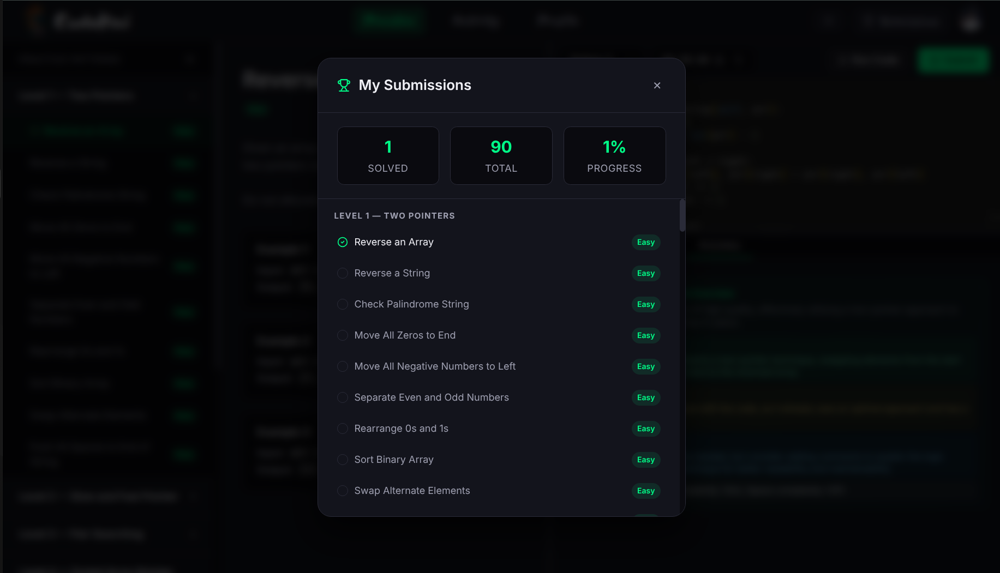

# CodeKai
## CodeKai - AI-Powered DSA Learning Platform
Deployed version - [CodeKai](https://codekai.vercel.app)

CodeKai is an interactive, AI-powered Data Structures and Algorithms (DSA) learning and execution platform. Designed to help developers refine their coding skills, it features a built-in code editor, multi-language compilation, and advanced AI-driven code analysis using Groq's LLM to provide instantaneous, expert-level feedback on algorithmic approaches and code quality. By automating code evaluation and improving learning efficiency, it empowers developers to focus on building strong problem-solving skills and mastering data structures effectively.

## Table of Contents
- [Overview and Architecture](#overview-and-architecture)
- [Installation](#installation)
- [Setup](#setup)
- [Usage](#usage)
- [API Documentation](#api-documentation)
- [Tech Stack](#tech-stack)

## Overview and Architecture
### Overview:

In response to the challenges faced by developers in gathering comprehensive feedback and generating tailored learning paths efficiently, we propose the development of CodeKai, an AI-powered DSA Learning Platform. This platform leverages advanced language models (LLMs) and secure code execution technologies to streamline the learning process, enhance coding engagements, and improve the accuracy and effectiveness of code submissions.

### Key Features:

- **Multi-Language Support**: Write and execute code in JavaScript, Python, Java, and C++, enabling seamless interaction during learning sessions.
- **Integrated Code Execution**: Secure code compilation and execution powered by the Wandbox API to execute code in real-time.
- **AI Code Review**: Leverages Groq's LLM to evaluate code quality, time/space complexity, and algorithmic efficiency, giving actionable feedback. By dynamically adapting its reviews based on the context of the code, the assistant ensures that no critical issues are overlooked.
- **User Authentication**: Secure user login and registration powered by Firebase.
- **Activity Tracking**: Visual heatmap of user activity and problem-solving streaks to further enhance the learning progress.
- **Interactive UI**: A rich, responsive user interface built with React and Vite.

### Architechture:

Architechture Diagram CodeKai Architecture Image

| Component | Functionality |
| :--- | :--- |
| React Frontend | - Sends code and execution queries to the system.<br>- Receives and displays AI feedback and execution results.<br>- Handles user authentication and activity tracking. |
| Express Node Backend | - Securely proxies and orchestrates execution requests.<br>- Communicates with Wandbox and Groq APIs. |
| Firebase Auth | - Authenticates users and manages sessions. |
| Wandbox API | - Compiles and executes code submissions. |
| Groq API | - Utilizes a Large Language Model to generate AI code analysis and feedback. |

## Installation
Clone the repository:

```bash
https://github.com/shravdalvi/CodeKai.git
```

Install dependancies for the frontend:

```bash
npm install
```

Install dependancies for the backend:

```bash
cd backend

npm install
```

## Setup
Run the frontend:

After installation navigate to the root directory.
Run the following command to start the frontend:
```bash
npm run dev
```
Open your web browser and go to http://localhost:5173 to access the application

Run the backend:

After installation navigate to the backend directory.
Locate the .env.example file.
Rename .env.example to .env.
Open the .env file in a text editor and fill in the required values for the environment variables.
Run the following command to start the backend:
```bash
npm start
```

## Usage
Test Users:
- Normal User
  - username: test_1
  - email: test@gmail.com
  - password: test@123
    
Demo:
- Video link - https://youtu.be/s5l6AAoT4o0
- Images
### Landing Page


### Why CodeKai


### Login


### Signup


### Dashboard


### Test Cases


### Code Quality Analysis (1)


### Code Quality Analysis (2)


### Accuracy Analysis


### Submission


### Contribution Heatmap


  
## API Documentation
Link: http://localhost:5000/api

## Tech Stack


Additional :
- Wandbox API
- Groq API

Demonstration Video
link - https://youtu.be/s5l6AAoT4o0
