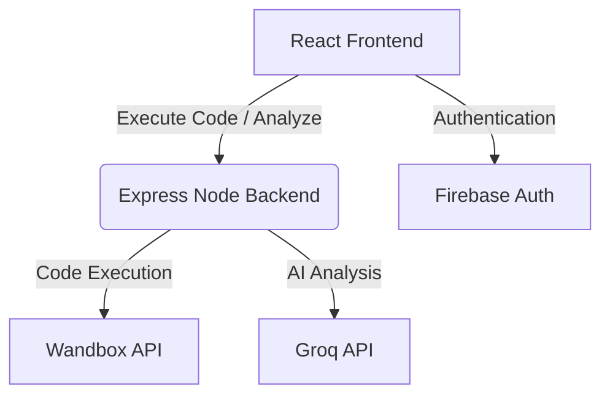

# CodeKai

## Table of Contents
- [Overview and Architecture](#overview-and-architecture)
  - [Overview](#overview)
  - [Key Features](#key-features)
  - [Architecture](#architecture)
  - [Architecture Diagram](#architecture-diagram)
- [Installation](#installation)
  - [Clone the Repository](#clone-the-repository)
  - [Install Frontend Dependencies](#install-frontend-dependencies)
  - [Install Backend Dependencies](#install-backend-dependencies)
- [Setup](#setup)
  - [Run the Backend](#run-the-backend)
  - [Run the Frontend](#run-the-frontend)
- [Usage](#usage)
- [Test Users](#test-users)
  - [Normal User](#normal-user)
  - [Admin](#admin)
- [Demo](#demo)
  - [Images](#images)
- [API Documentation](#api-documentation)
- [Tech Stack](#tech-stack)
- [Additional](#additional)
  - [Demonstration Video](#demonstration-video)

---

## Overview and Architecture

### Overview
CodeKai is an interactive, AI-powered Data Structures and Algorithms (DSA) learning and execution platform. Designed to help developers refine their coding skills, it features a built-in code editor, multi-language compilation, and advanced AI-driven code analysis using Groq's LLM to provide instantaneous, expert-level feedback on algorithmic approaches and code quality.

### Key Features
- **Multi-Language Support**: Write and execute code in JavaScript, Python, Java, and C++.
- **Integrated Code Execution**: Secure code compilation and execution powered by the Wandbox API.
- **AI Code Review**: Leverages Groq's LLM to evaluate code quality, time/space complexity, and algorithmic efficiency, giving actionable feedback.
- **User Authentication**: Secure user login and registration powered by Firebase.
- **Activity Tracking**: Visual heatmap of user activity and problem-solving streaks.
- **Interactive UI**: A rich, responsive user interface built with React and Vite.

### Architecture
CodeKai follows a decoupled client-server architecture:
- **Frontend**: A React application (bootstrapped with Vite) that provides the user interface, code editor (Monaco Editor), and authentication state management.
- **Backend**: An Express.js Node server that acts as a secure proxy and orchestration layer. It communicates with the Wandbox API for code execution and the Groq API for AI-assisted code analysis.

### Architecture Diagram



---

## Installation

### Clone the Repository
```bash
git clone https://github.com/your-username/CodeKai.git
cd CodeKai
```

### Install Frontend Dependencies
```bash
npm install
```

### Install Backend Dependencies
```bash
cd backend
npm install
```

---

## Setup
Ensure you configure the environment variables for both the frontend and backend.

**Backend `.env` (in `/backend/.env`):**
```env
GROQ_API_KEY=your_groq_api_key_here
PORT=5000
```

**Frontend `.env` (in root `.env`):**
Configure your Firebase settings and any Vite-specific environment variables.

### Run the Backend
Open a terminal, navigate to the `backend` folder, and start the server:
```bash
cd backend
npm start
```

### Run the Frontend
Open a new terminal, navigate to the project root, and start the Vite development server:
```bash
npm run dev
```

---

## Usage
1. Open your browser and navigate to `http://localhost:5173`.
2. Sign in using your Firebase authentication credentials.
3. Select a DSA problem from the dashboard.
4. Choose your preferred programming language and write your solution in the integrated code editor.
5. Click **Run** to execute your code against test cases.
6. Click **Analyze** to get detailed AI feedback on your algorithmic approach and code quality.

---

## Test Users
*(You can create users via the Firebase Authentication console or sign up directly in the application)*

### Normal User
- **Email:** `user@example.com`
- **Password:** `password123`

### Admin
- **Email:** `admin@example.com`
- **Password:** `admin123`

---

## Demo

### Images
*(Add screenshots of your CodeKai UI, editor, and AI feedback here)*
- 
- 

---

## API Documentation
The CodeKai Express backend exposes the following key endpoints:

### `POST /api/execute`
- **Description**: Compiles and runs code using Wandbox.
- **Body Example**: 
  ```json
  { 
    "lang": "python", 
    "code": "print('Hello CodeKai')" 
  }
  ```
- **Response**: JSON indicating compilation status, execution output, and errors.

### `POST /api/analyze`
- **Description**: Analyzes code quality and complexity using Groq AI.
- **Body Example**: 
  ```json
  { 
    "question": { "title": "Two Sum", "description": "..." }, 
    "code": "...", 
    "language": "python", 
    "testResults": [...] 
  }
  ```
- **Response**: JSON payload containing accuracy, summary, complexity, and specific code quality feedback.

---

## Tech Stack
- **Frontend**: React, Vite, Monaco Editor, Firebase (Authentication)
- **Backend**: Node.js, Express.js, Axios, Groq SDK
- **External Services**: Wandbox API (Code Compilation), Groq API (AI Code Analysis)

---

## Additional

### Demonstration Video
*(Link your Loom, YouTube, or MP4 demonstration video here)*
- [Watch the CodeKai Demo Video](#)
